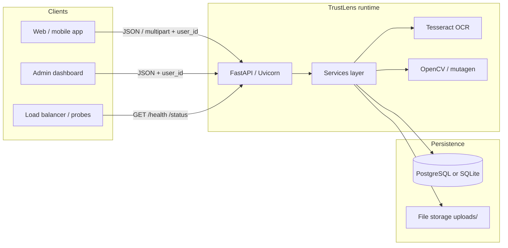
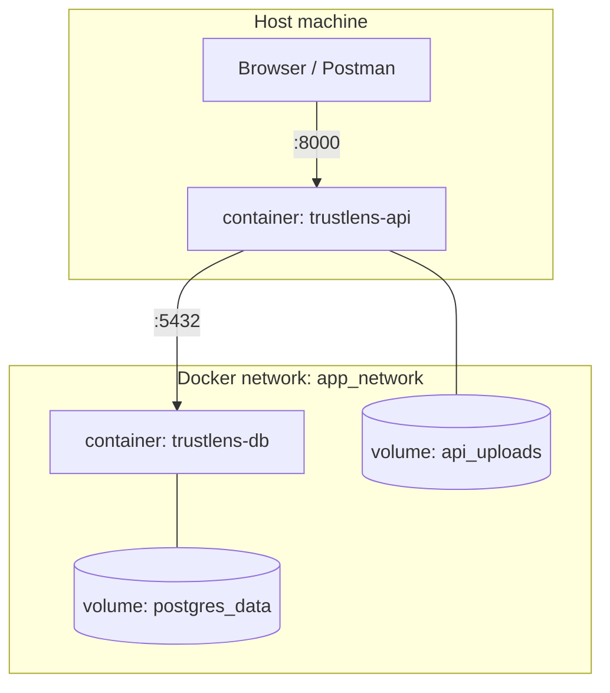
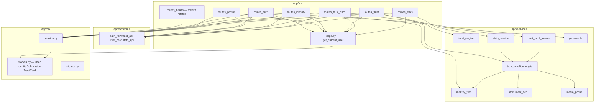
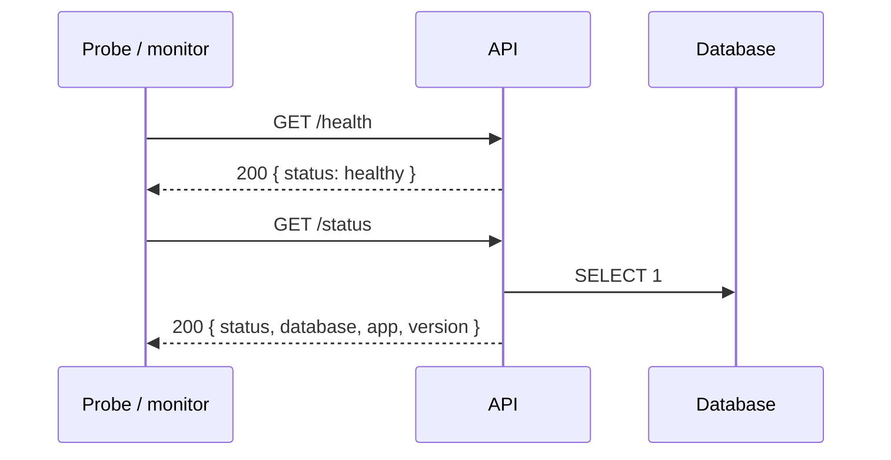
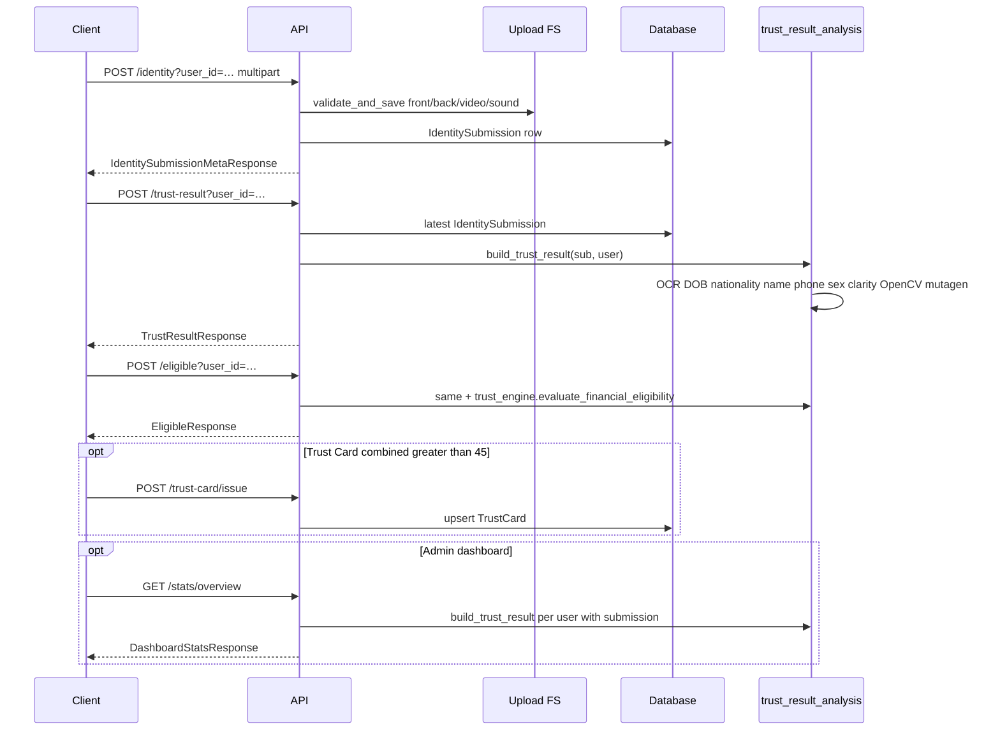
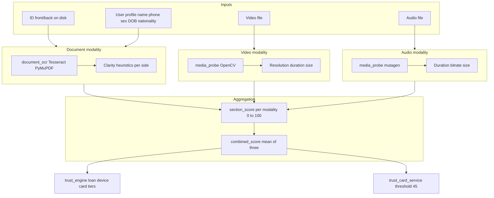

# TrustLens AI — System architecture

This document describes how the **TrustLens** backend is structured, how components interact, and how it runs in Docker vs locally. For HTTP details, see **[API.md](./API.md)**.

---

## 1. High-level view



**API surface (conceptual):**

| Area | Routes | Auth |
|------|--------|------|
| **Liveness / readiness** | `GET /health`, `GET /status` | None |
| **Auth & profile** | `/auth/*`, `GET /profile` | `user_id` on protected routes |
| **eKYC uploads** | `POST/GET /identity` | `user_id` |
| **Trust & eligibility** | `POST /trust-result`, `POST /eligible` | `user_id` |
| **Trust Card (demo)** | `POST /trust-card/issue`, `GET /trust-card`, `POST /trust-card/select` | `user_id` |
| **Analytics** | `GET /stats/overview`, `GET /stats/risk` | `user_id` (no admin RBAC yet) |

- **Services** implement validation, trust scoring, OCR, media probes, eligibility rules, card issuance heuristics, and **aggregate stats** (stats reuse the trust pipeline).
- **Database** stores users, identity submissions, and **trust_cards** (one demo card per user when eligible).
- **File storage** holds ID front/back, video, and audio (**relative paths** in DB; not base64 in `GET /identity`).

---

## 2. Deployment topology (Docker Compose)



| Service | Image / build | Role |
|---------|----------------|------|
| **api** | `Dockerfile` (Python 3.12, Tesseract) | FastAPI app, port **8000** → host |
| **db** | `docker/db` | PostgreSQL, **no** host port by default (only reachable from `api`) |

Environment: `DATABASE_URL` points the API at `db:5432`. Uploads persist in the **`api_uploads`** named volume.

**Local (non-Docker):** `database_url` defaults to SQLite under `./data/`; uploads default to `./uploads/` (see `app/config.py`).

---

## 3. Application layering (code layout)



| Layer | Responsibility |
|-------|----------------|
| **Routes** | HTTP mapping, status codes, DI (`get_current_user`, `get_db`) |
| **Schemas** | Pydantic request/response models and OpenAPI |
| **Services** | Files, trust breakdown, OCR (name/phone/sex/DOB/nationality), eligibility, trust card threshold, **stats aggregations** |
| **DB** | ORM models, `init_db()` + `create_all` + `migrate` hooks |

**Entry point:** `app/main.py` — lifespan creates `data/` and upload dir, runs `init_db()`, mounts routers (**health first**, then auth → profile → identity → trust → trust_card → stats).

---

## 4. Core domain entities (data model)

```mermaid
erDiagram
  User ||--o{ IdentitySubmission : owns
  User ||--o| TrustCard : "optional 1:1"

  User {
    uuid id PK
    string full_name
    string phone UK
    string sex "column gender"
    date date_of_birth
    string nationality
    string occupation
    string business_type
    float monthly_income
    string password_hash
    datetime created_at
  }

  TrustCard {
    uuid id PK
    uuid user_id FK UK
    uuid submission_id FK
    int combined_score_at_issue
    string card_suffix
    string selected_product
    datetime created_at
    datetime updated_at
  }

  IdentitySubmission {
    uuid id PK
    uuid user_id FK
    datetime created_at
    string document_front_path
    string document_back_path
    string video_path
    string audio_path
    int document_front_size_bytes
    int document_back_size_bytes
    int video_size_bytes
    int audio_size_bytes
    bool eligible
    string eligibility_reasons
    int trust_score
    string risk_level
    string trust_reasons
  }
```

Paths under `uploads/` are **relative** strings; resolved via `settings.upload_dir` and `identity_files.absolute_under_uploads`.

---

## 5. Request flows

### 5.1 Health (no auth)



`/health` does **not** ping the DB. `/status` does — use for readiness-style monitoring.

### 5.2 Registration / session (demo auth)

```mermaid
sequenceDiagram
  participant C as Client
  participant A as API
  participant DB as Database

  C->>A: POST /auth/sign-up or /auth/sign-in
  A->>DB: insert or lookup User
  A-->>C: UserProfileResponse including id
  Note over C: Store id; send as user_id query param on protected routes
```

**Auth model:** `user_id` query parameter (`get_current_user`). **Hackathon-style**, not production OAuth2/JWT.

### 5.3 Identity upload → trust → eligibility → card → stats



**Latest submission:** `GET /identity`, `POST /trust-result`, `POST /eligible`, and trust-card **issue** logic all anchor on the **most recent** `IdentitySubmission` by `created_at` for that user.

**Stats:** `stats_service` calls **`build_trust_result`** once per user who has at least one submission — correct but **O(users)**; fine for demos, cache or batch for scale.

---

## 6. Trust pipeline (logical)



Many checks remain **heuristic** or **uncertain** (default priors) until stronger ML (face, liveness, ASR) is added.

---

## 7. Trust Card & analytics (cross-cutting)

| Component | Role |
|-----------|------|
| **`trust_card_service`** | Reads live **`combined_score`** via **`build_trust_result`**; issues **`TrustCard`** row if score **> 45**; mock display suffix; product selection persisted. |
| **`stats_service`** | Counts users/submissions; recomputes trust per user for **prime** count, **global** average, **modality pass rates**, **risk tiers**, and **suspicious pattern** heuristics. |
| **`trust_engine`** | Maps **`combined_score`** to loan tiers and device/card **eligibility flags** (unchanged contract for `/eligible`). |

---

## 8. External dependencies (runtime)

| Dependency | Used for |
|------------|----------|
| **PostgreSQL** (Compose) / **SQLite** (default local) | Users, submissions, trust_cards |
| **Filesystem** | Uploaded binaries |
| **Tesseract** | OCR — name, phone, sex, **DOB**, **nationality** on ID |
| **PyMuPDF** | PDF first page → image → OCR |
| **OpenCV (headless)** | Video metadata |
| **mutagen** | Audio metadata |
| **passlib + bcrypt** | Password hashing |

---

## 9. Security & operations notes (honest scope)

- **Transport:** Use HTTPS in production in front of Uvicorn.
- **Authentication:** Raw **`user_id`** query string is **not** production-grade; add JWT/OAuth and **roles** (e.g. restrict **`/stats/*`** to admins).
- **`/stats/*`:** Same gate as **`/profile`** today — any valid user can call analytics; fix before real multi-tenant use.
- **Secrets:** Use proper secret management for DB URLs and keys in production.
- **File access:** No public CDN for uploads; add signed URLs or a gated download API if the UI must show media.
- **Trust Card:** Demo only — not PCI, not a real PAN.

---

## 10. Related docs

- **[API.md](./API.md)** — All routes, bodies, `user_id`, health vs stats vs trust **`status`** fields.
- **[SCORING_MODEL_AND_PRESENTATION_FAQ.md](./SCORING_MODEL_AND_PRESENTATION_FAQ.md)** — How scores are computed and presentation Q&A.
