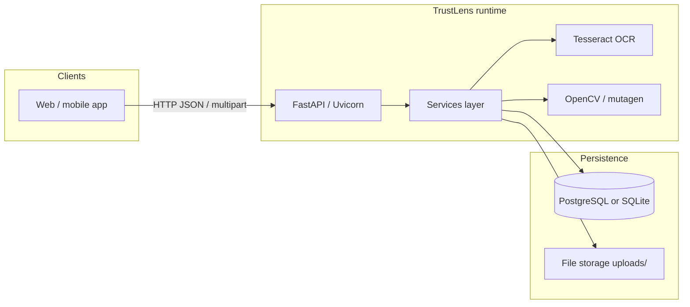
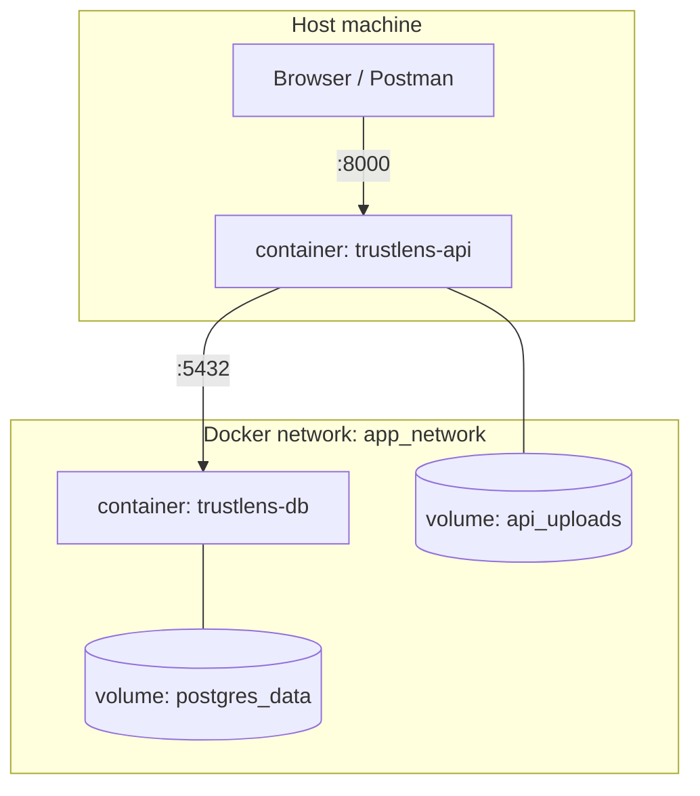
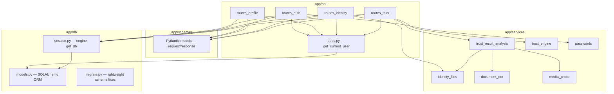
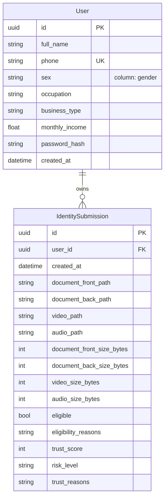
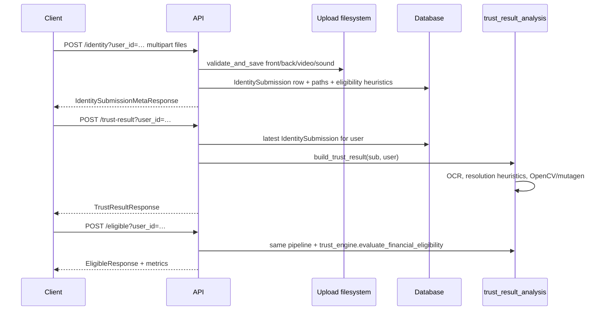
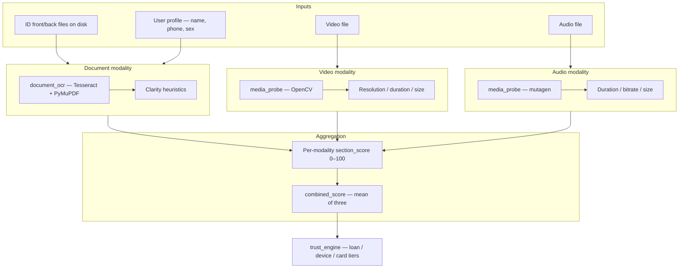

# TrustLens AI — System architecture

This document describes how the **TrustLens** backend is structured, how components interact, and how it runs in Docker vs locally.

---

## 1. High-level view



- **API** exposes REST endpoints (`/auth`, `/profile`, `/identity`, `/trust-result`, `/eligible`).
- **Services** implement validation, trust scoring, OCR, and media probing.
- **Database** stores users and identity submission metadata (paths, sizes, eligibility flags).
- **File storage** holds uploaded ID images, video, and audio (not returned as base64 from `GET /identity`).

---

## 2. Deployment topology (Docker Compose)



| Service | Image / build | Role |
|---------|----------------|------|
| **api** | `Dockerfile` (Python 3.12, Tesseract) | FastAPI app, port **8000** → host |
| **db** | `docker/db` | PostgreSQL, **no** host port by default (only reachable from `api`) |

Environment: `DATABASE_URL` points the API at `db:5432`. Uploads persist in the **`api_uploads`** named volume.

**Local (non-Docker):** `database_url` defaults to SQLite under `./data/`; uploads default to `./uploads/` (see `app/config.py`).

---

## 3. Application layering (code layout)



| Layer | Responsibility |
|-------|----------------|
| **Routes** | HTTP mapping, status codes, dependency injection |
| **Schemas** | Validation and OpenAPI shapes |
| **Services** | Business rules: file validation, trust breakdown, eligibility bands, OCR |
| **DB** | Persistence, `init_db()` + `create_all` + `migrate` hooks |

**Entry point:** `app/main.py` — lifespan creates `data/` and upload dir, runs `init_db()`, mounts routers.

---

## 4. Core domain entities (data model)



Paths under `uploads/` are **relative** strings stored in the DB; the server resolves them against `settings.upload_dir`.

---

## 5. Request flows

### 5.1 Registration / session (demo auth)

```mermaid
sequenceDiagram
  participant C as Client
  participant A as API
  participant DB as Database

  C->>A: POST /auth/sign-up or /auth/sign-in
  A->>DB: insert or lookup User
  A-->>C: UserProfileResponse including id
  Note over C: Store id; send as user_id query param on protected routes
```

**Auth model:** `user_id` query parameter resolves the user (`get_current_user`). This is a **hackathon-style** pattern, not production OAuth2/JWT.

### 5.2 Identity upload → trust → eligibility



**Latest submission:** `GET /identity`, `POST /trust-result`, and `POST /eligible` all use the **most recent** `IdentitySubmission` by `created_at` for that `user_id`.

---

## 6. Trust pipeline (logical)



Many checks are **heuristic** or **uncertain** (placeholder scores until real ML/face/liveness/ASR is added). OCR depends on **Tesseract** (bundled in Docker image; optional `TESSERACT_CMD` on Windows).

---

## 7. External dependencies (runtime)

| Dependency | Used for |
|------------|----------|
| **PostgreSQL** (Compose) / **SQLite** (default local) | Users, submissions |
| **Filesystem** | Uploaded binaries |
| **Tesseract** | `pytesseract` — ID text for name/phone/sex matching |
| **PyMuPDF** | First page of PDF IDs → raster → OCR |
| **OpenCV (headless)** | Video width/height/duration when decodable |
| **mutagen** | Audio duration/bitrate when metadata exists |
| **passlib + bcrypt** | Password hashing |

---

## 8. Security & operations notes (honest scope)

- **Transport:** Assume HTTPS in production in front of Uvicorn (reverse proxy).
- **Authentication:** Passing raw `user_id` in the query string is **not** secure for production; replace with sessions/JWT/OAuth and authorization checks.
- **Secrets:** DB credentials in Compose are for dev; use secrets management in production.
- **File access:** No public CDN URL for uploads in the current design; add signed URLs or a gated download API if the frontend must display media.

---

## 9. Related docs

- **[API.md](./API.md)** — Endpoints, bodies, and query parameters for frontend integration.
